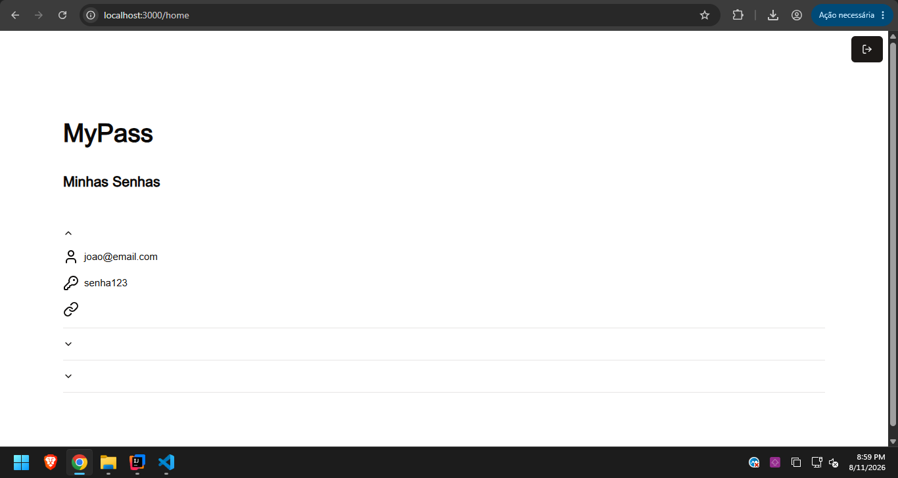

# MyPass - Projeto Java Advanced - 2TDSPX

* Feito por: Lucas Grillo Alcântara - RM561413

## Configuração

As chaves RSA utilizadas para autenticação JWT não são versionadas por questões de segurança.

Antes de executar a aplicação pela primeira vez, execute a classe:

`br.com.mypass.GenerateKeys`

Ela irá gerar automaticamente:

`src/main/resources/keys/private_key.pem`

`src/main/resources/keys/public_key.pem`

Após a geração das chaves, execute a aplicação normalmente através da classe `MypassApplication`.

### Testando a API

Com a aplicação executando em `http://localhost:8080`, utilize o arquivo `mypass.http`.

Primeiro execute o endpoint `POST /login`:

```http
POST http://localhost:8080/login
Content-Type: application/json

{
  "username": "joao",
  "password": "123456"
}
```

O endpoint retornará um token JWT. Utilize o token retornado para autenticar as requisições ao endpoint de senhas:

```http
GET http://localhost:8080/pass
Authorization: Bearer SEU_TOKEN_AQUI
```

### Teste da Aplicação

Abaixo está uma captura de tela demonstrando o teste da aplicação e o funcionamento dos endpoints:

